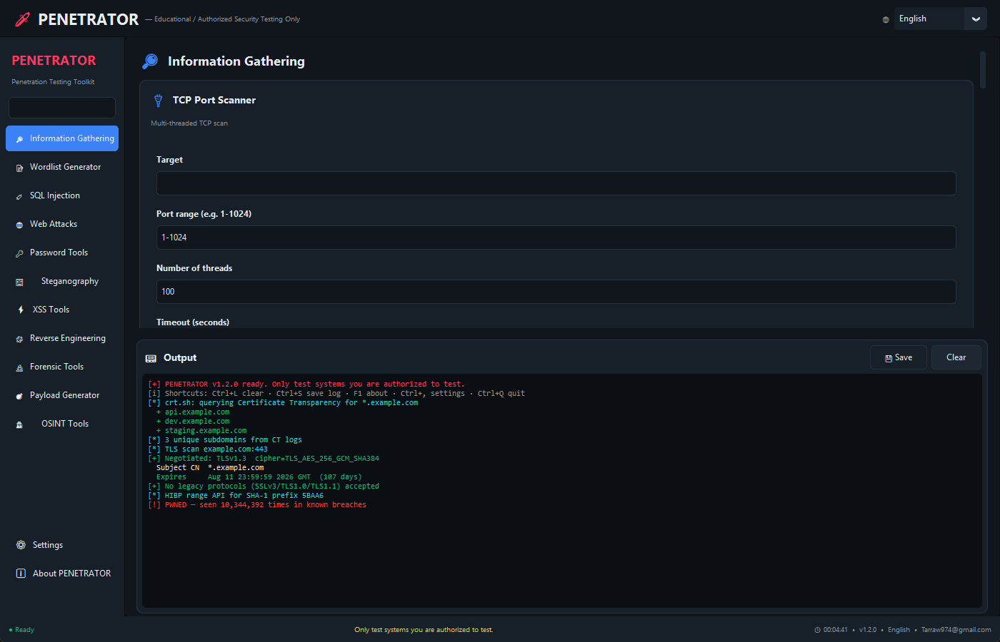
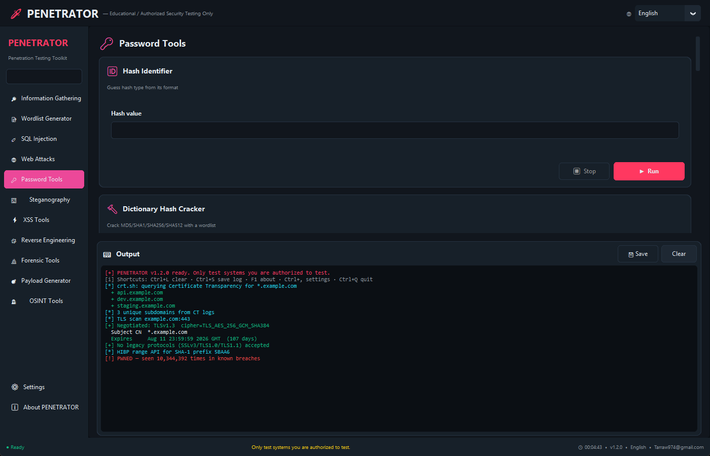
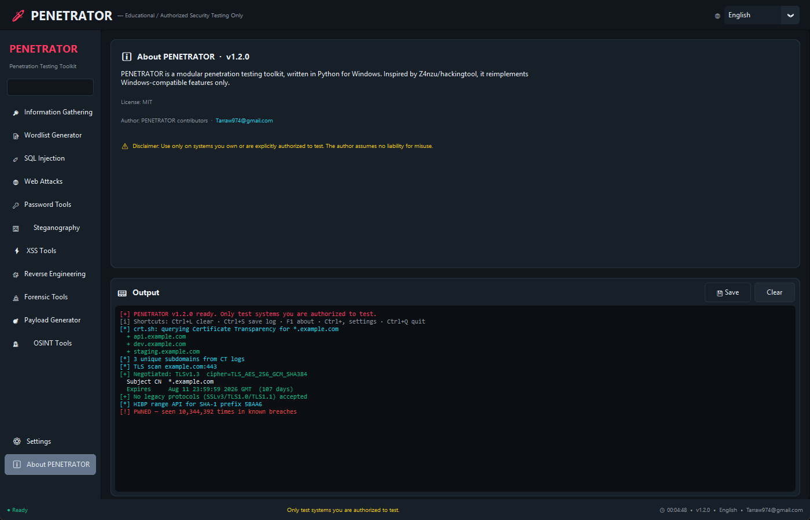
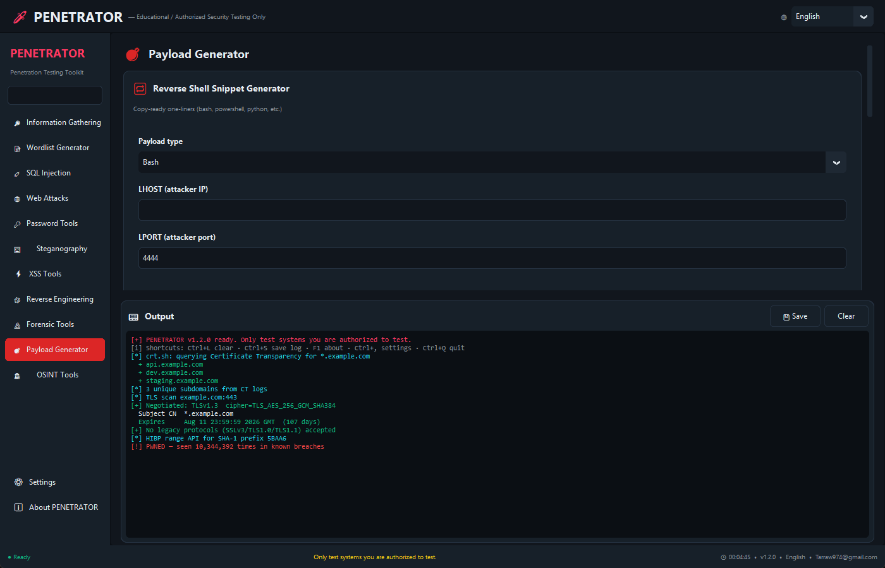
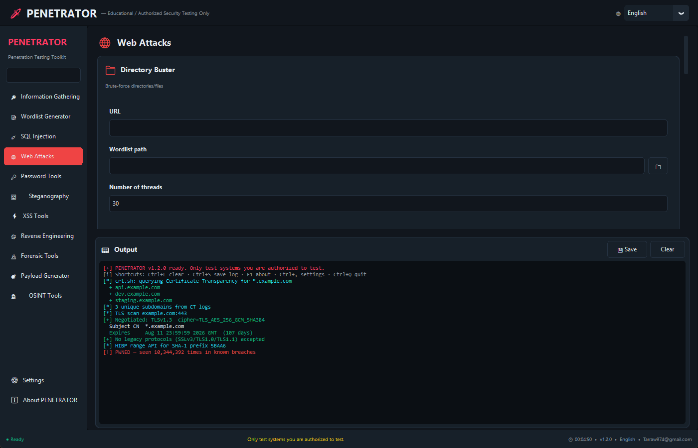
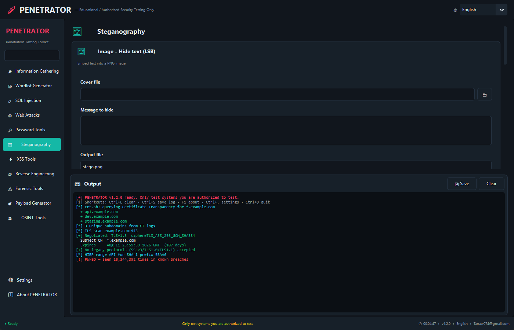
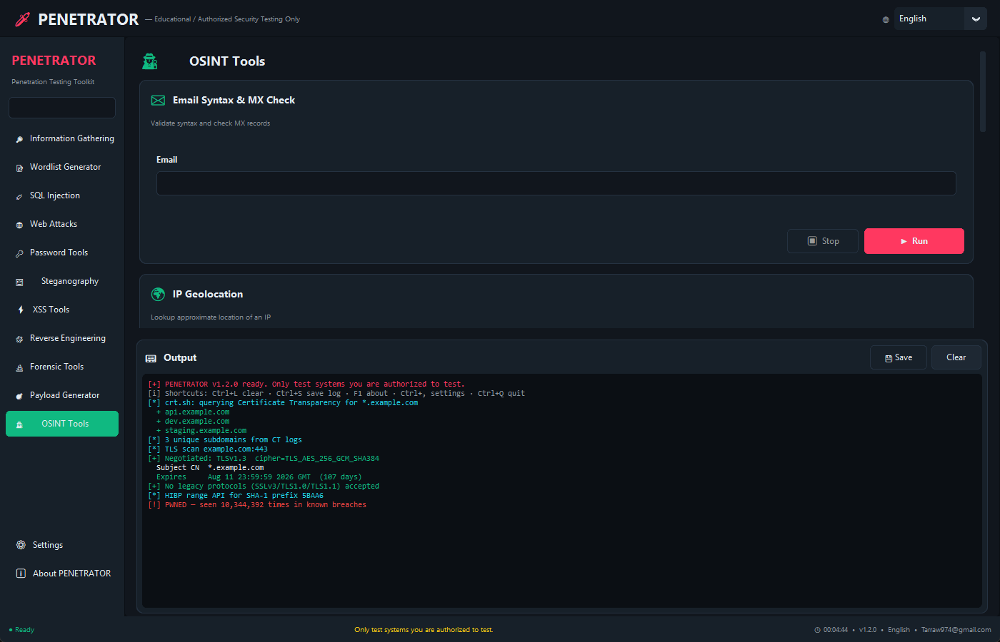
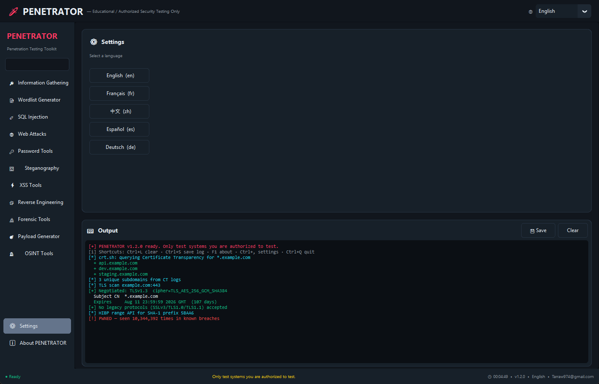

<p align="center">
  
</p>

<p align="center">
  <strong>The modern Windows-native penetration testing toolkit.</strong><br/>
  <em>49&nbsp;tools · 11&nbsp;categories · 5&nbsp;langues · 1 interface</em>
</p>

<p align="center">
  
  
  
  
  
</p>

<p align="center">
  <a href="#-install-en-1-clic">Install</a> ·
  <a href="#-features">Features</a> ·
  <a href="#-screenshots">Screenshots</a> ·
  <a href="#%EF%B8%8F-legal">Legal</a>
</p>

---

## 🗡️ What is PENETRATOR?

A complete, Windows-first Python 3 penetration testing toolkit — **no WSL, no Kali VM, no half-broken ports.**

Ships with a **dark modern GUI** (CustomTkinter) *and* a Rich-powered **classic CLI**. Both wrap the same internal engine.

> 🇬🇧 English &nbsp;·&nbsp; 🇫🇷 Français &nbsp;·&nbsp; 🇨🇳 中文 &nbsp;·&nbsp; 🇪🇸 Español &nbsp;·&nbsp; 🇩🇪 Deutsch — switchable in one click, live.

---

## 📦 Download

> **🚀 [Get the latest release →](https://github.com/Oli97430/PENETRATOR/releases/latest)**
> Pre-built `PENETRATOR.exe` for Windows — no Python install required.

## ⚡ Install from source (en 1 clic)

```
git clone https://github.com/Oli97430/PENETRATOR.git
cd PENETRATOR
install.bat
```

The auto-installer detects Python, upgrades pip, pulls every dependency, installs `sqlmap`, and drops a **desktop shortcut**. No manual configuration.

Then just double-click the shortcut — or:

```powershell
.\penetrator.bat        # Modern GUI
.\penetrator_cli.bat    # Classic CLI
```

---

## 🚀 Features

<table>
<tr>
<td valign="top" width="50%">

### 🔎 Information Gathering
TCP port scanner (multi-threaded) · Host→IP · WHOIS · DNS (A/AAAA/MX/NS/TXT/CNAME/SOA) · Subdomain brute-force · HTTP header analyzer · Nmap wrapper

### 📝 Wordlist Generator
CUPP-style targeted list · Combinator · Leet / case mutator · Charset pattern generator

### 💉 SQL Injection
`sqlmap` wrapper · Parameter-based quick detection · Payload library

### 🌐 Web Attacks
Directory buster · URL status checker · Security-headers audit · `robots.txt` / sitemap / `.well-known` · Technology fingerprinting

### 🔑 Password Tools
Hash identifier · Dictionary cracker (MD5 / SHA-1 / 224 / 256 / 384 / 512) · Strength meter · Secure password generator

### 🖼️ Steganography
PNG LSB hide/extract · Whitespace hide/extract

</td>
<td valign="top" width="50%">

### ⚡ XSS Tools
Payload generator (basic · polyglot · WAF-bypass) · Reflected scanner · Payload encoder

### 🧩 Reverse Engineering
Strings extractor · PE / section parser · Hex dump · File hashes

### 🔬 Forensic
EXIF reader · Hex viewer · Magic-bytes identifier · Binary diff

### 💣 Payload Generator
Reverse shells — bash, PowerShell, Python (nix/win), Perl, PHP, Ruby, nc, socat · Bind shells · `msfvenom` wrapper · base64 / hex / UTF-16LE encoder

### 🕵️ OSINT
Email syntax + MX check · IP geolocation · Username search on 20+ sites · Phone-number info · Reverse DNS

### 🌐 Localisation à chaud
EN · FR · 中文 — bascule live, zéro redémarrage.

</td>
</tr>
</table>

---

## 🖼️ Screenshots

<p align="center">
  
  <em>Information Gathering — port scanner, DNS, WHOIS, subdomain finder…</em>
</p>

<table>
<tr>
<td width="50%"></td>
<td width="50%"></td>
</tr>
<tr>
<td align="center"><em>🔑 Password Tools (with HIBP, JWT)</em></td>
<td align="center"><em>ℹ️ About</em></td>
</tr>
<tr>
<td width="50%"></td>
<td width="50%"></td>
</tr>
<tr>
<td align="center"><em>💣 Payload Generator</em></td>
<td align="center"><em>🌐 Web Attacks (with HTTP Repeater)</em></td>
</tr>
<tr>
<td width="50%"></td>
<td width="50%"></td>
</tr>
<tr>
<td align="center"><em>🖼️ Steganography</em></td>
<td align="center"><em>🕵️ OSINT</em></td>
</tr>
<tr>
<td colspan="2" align="center"></td>
</tr>
<tr>
<td colspan="2" align="center"><em>⚙️ Settings — 5 languages, live-switch (EN / FR / ZH / ES / DE)</em></td>
</tr>
</table>

---

## 🧪 Qualité

- ✅ **25/25** tests fonctionnels sur le moteur (scan, crack MD5, stego PNG round-trip, wordlist, etc.)
- ✅ Toutes les catégories se chargent sans exception
- ✅ Traductions complètes EN / FR / ZH (0 clé manquante)
- ✅ Threads d'arrière-plan — l'UI ne fige jamais

---

## 🎯 Pourquoi pas certaines features ?

Volontairement exclues du portage, par cohérence Windows **et** par principe :

- 🚫 **Attaques Wi-Fi** (Wifite, Fluxion…) — dépendent du mode monitor `mac80211` Linux
- 🚫 **DDoS / stress tools** — destructif, pas dual-use
- 🚫 **Phishing frameworks** (SocialFish, BlackPhish…) — collecte massive de credentials
- 🚫 **RATs cachés / keyloggers / spycams** — malveillant par conception
- 🚫 **Anonsurf / Multitor** — dépendent d'iptables / NetworkManager

Les cas légitimes restent couverts par l'OSINT, le pentest web et l'audit de mots de passe.

---

## ⚖️ Legal

> PENETRATOR est un outil d'**éducation**, de **pentest autorisé** et de **CTF / labo**.
> L'utiliser contre des systèmes que vous ne possédez pas ou pour lesquels vous n'avez pas d'autorisation écrite est **illégal** dans la plupart des juridictions.
> Les auteurs déclinent **toute responsabilité** en cas d'utilisation malveillante.

---

## 📜 License

MIT License

**Author** — Tarraw · [Tarraw974@gmail.com](mailto:Tarraw974@gmail.com)

<p align="center">
  <sub>Built with 🗡️ and too much coffee by <a href="mailto:Tarraw974@gmail.com">Tarraw974@gmail.com</a>.</sub>
</p>
